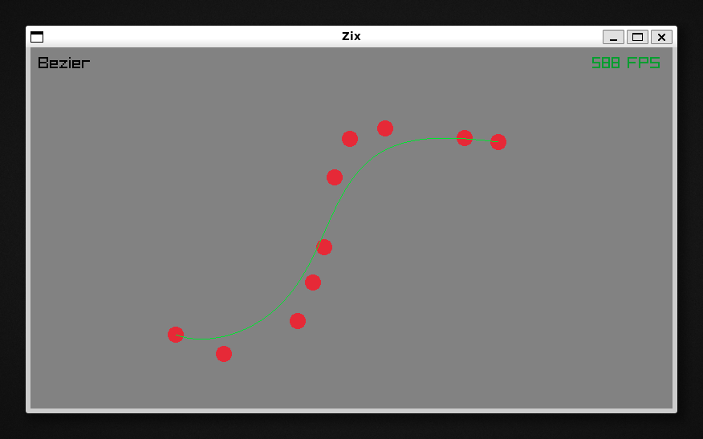
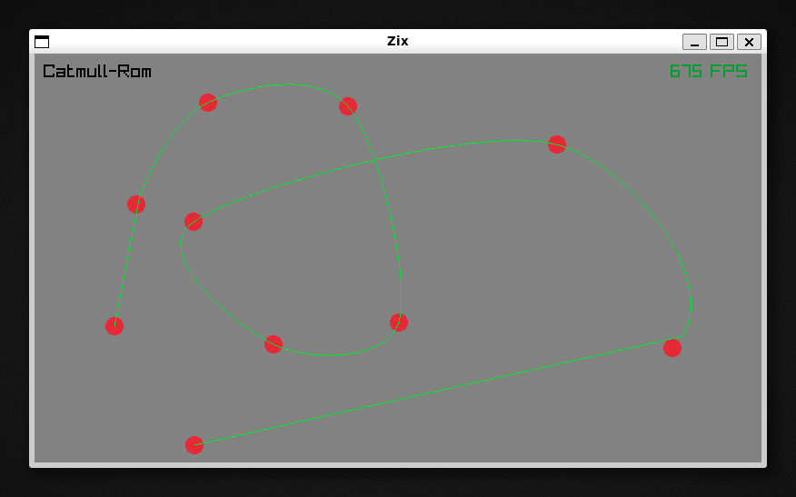
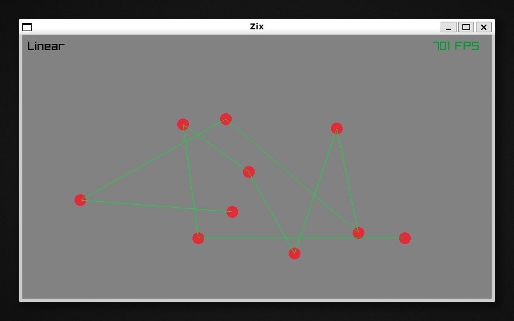

# Zix (Spline visualizer in Zig)

Zix is a spline visualizer written in zig that use Raylib for rendering and Nix for dev-env.

I will try to implement these functions:
- :white_check_mark: Bézier
- :triangular_flag_on_post: Hermite
- :white_check_mark: Catmull-Rom
- :triangular_flag_on_post: B-Spline
- :triangular_flag_on_post: Linear

## :bookmark_tabs: <samp>Requirements</samp>

- :cherry_blossom: [Nix](https://nixos.org/download.html)

> [!IMPORTANT]
> You will need to enable `nix-command` and `flakes`experimental features
> If you get an error about it, consider this command:
> `mkdir -p ~/.config/nix && echo "experimental-features = nix-command flakes" | tee ~/.config/nix/nix.conf`

## :zap: <samp>Usage</samp>

### :wrench: <samp>Setup</samp>

Clone this repository and navigate to the project directory.
```shell
git clone https://github.com/Miou-zora/Zix.git
cd Zix
```

### :construction_worker: <samp>Building</samp>

```shell
zig build
```


### :rocket: <samp>Running</samp>


```shell
# It will build the project and run it. (do nothing if the project is already built)
zig build run
# or you can run the executable directly
./zig-out/bin/Zix
```

> [!NOTE]
> `nix build` is not supported yet. If you try to use it, it will create a `result` symlink that contain the executable BUT musl isn't linked correctly to binary. It would be appreciated if someone could help me to fix this issue.

### :heavy_plus_sign: <samp>Using direnv</samp>

You may load the devShell automatically using [direnv](https://direnv.net)
shell integration.

```
echo "use flake" | tee .envrc
direnv allow
```

## :art: <samp> <i>(Current*)</i> Result</samp>
<div align="center">

</br>

</div>

> [!WARNING]
> *currenlty WIP
